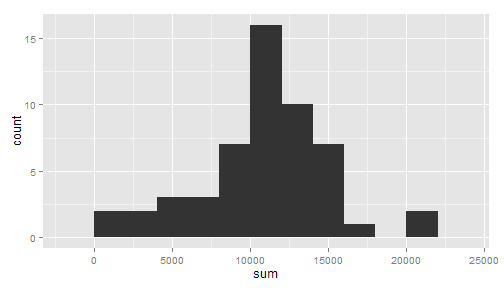
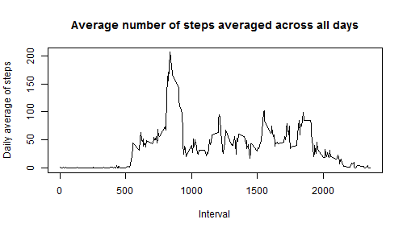
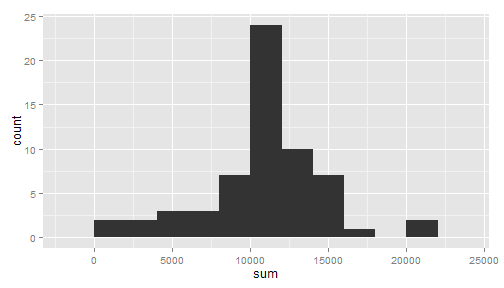
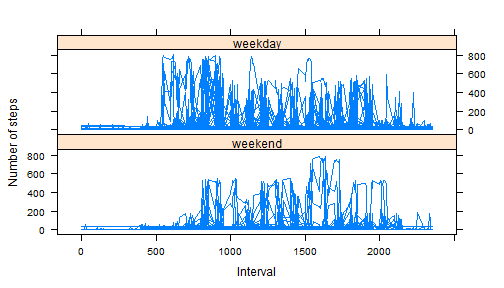

## Background
A large amount of data about personal movement was collected from activity monitoring devices such as a Fitbit, Nike Fuelband and Jawbone Up. These type of devices are part of the "quantified self" movement - a group of enthusiasts who take measurements about themselves regularly:  
- to improve their health  
- to find patterns in their behavior  
- or because they are tech geeks.  
This project makes use of data from a personal activity monitoring device. This device collects data at 5 minute intervals through out the day. The data consists of two months of data from an anonymous individual collected during the months of October and November, 2012 and include the number of steps taken in 5 minute intervals each day.  


## Data
The variables included in this dataset are:  
- **steps**: Number of steps taking in a 5-minute interval (missing values are coded as NA)  
- **date**: The date on which the measurement was taken in YYYY-MM-DD format  
- **interval**: Identifier for the 5-minute interval in which measurement was taken.  
The dataset is stored in a comma-separated-value (CSV) file and there are a total of 17,568 observations. 

## Loading and preprocessing the data  
Code:  

```r
data<-read.csv("./repdata-data-activity/activity.csv", colClasses=c("integer", "character", "integer"))
```

## What is mean total number of steps taken per day?
The missing values in the dataset were ignored in this step.  
1. Total number of steps taken per day  
Code:  

```r
library(plyr)
tabsum<-ddply(data, .(date), summarize, sum=sum(steps))
```
Total number of steps per day:

```
##          date   sum
## 1  2012-10-01    NA
## 2  2012-10-02   126
## 3  2012-10-03 11352
## 4  2012-10-04 12116
## 5  2012-10-05 13294
## 6  2012-10-06 15420
## 7  2012-10-07 11015
## 8  2012-10-08    NA
## 9  2012-10-09 12811
## 10 2012-10-10  9900
## 11 2012-10-11 10304
## 12 2012-10-12 17382
## 13 2012-10-13 12426
## 14 2012-10-14 15098
## 15 2012-10-15 10139
## 16 2012-10-16 15084
## 17 2012-10-17 13452
## 18 2012-10-18 10056
## 19 2012-10-19 11829
## 20 2012-10-20 10395
## 21 2012-10-21  8821
## 22 2012-10-22 13460
## 23 2012-10-23  8918
## 24 2012-10-24  8355
## 25 2012-10-25  2492
## 26 2012-10-26  6778
## 27 2012-10-27 10119
## 28 2012-10-28 11458
## 29 2012-10-29  5018
## 30 2012-10-30  9819
## 31 2012-10-31 15414
## 32 2012-11-01    NA
## 33 2012-11-02 10600
## 34 2012-11-03 10571
## 35 2012-11-04    NA
## 36 2012-11-05 10439
## 37 2012-11-06  8334
## 38 2012-11-07 12883
## 39 2012-11-08  3219
## 40 2012-11-09    NA
## 41 2012-11-10    NA
## 42 2012-11-11 12608
## 43 2012-11-12 10765
## 44 2012-11-13  7336
## 45 2012-11-14    NA
## 46 2012-11-15    41
## 47 2012-11-16  5441
## 48 2012-11-17 14339
## 49 2012-11-18 15110
## 50 2012-11-19  8841
## 51 2012-11-20  4472
## 52 2012-11-21 12787
## 53 2012-11-22 20427
## 54 2012-11-23 21194
## 55 2012-11-24 14478
## 56 2012-11-25 11834
## 57 2012-11-26 11162
## 58 2012-11-27 13646
## 59 2012-11-28 10183
## 60 2012-11-29  7047
## 61 2012-11-30    NA
```
2. The histogram of the total number of steps taken each day  
Code:  

```r
library(ggplot2)
qplot(sum,data=tabsum, binwidth=2000)
```

 
  
3. Calculation of the mean and median of the number of steps taken per day  
Code:  

```r
tabmean<-ddply(data, .(date), summarize, mean=mean(steps))
tabmedian<-ddply(data, .(date), summarize, median=median(steps))
```
  
Mean of the number of steps taken per day:  

```
##          date       mean
## 1  2012-10-01         NA
## 2  2012-10-02  0.4375000
## 3  2012-10-03 39.4166667
## 4  2012-10-04 42.0694444
## 5  2012-10-05 46.1597222
## 6  2012-10-06 53.5416667
## 7  2012-10-07 38.2465278
## 8  2012-10-08         NA
## 9  2012-10-09 44.4826389
## 10 2012-10-10 34.3750000
## 11 2012-10-11 35.7777778
## 12 2012-10-12 60.3541667
## 13 2012-10-13 43.1458333
## 14 2012-10-14 52.4236111
## 15 2012-10-15 35.2048611
## 16 2012-10-16 52.3750000
## 17 2012-10-17 46.7083333
## 18 2012-10-18 34.9166667
## 19 2012-10-19 41.0729167
## 20 2012-10-20 36.0937500
## 21 2012-10-21 30.6284722
## 22 2012-10-22 46.7361111
## 23 2012-10-23 30.9652778
## 24 2012-10-24 29.0104167
## 25 2012-10-25  8.6527778
## 26 2012-10-26 23.5347222
## 27 2012-10-27 35.1354167
## 28 2012-10-28 39.7847222
## 29 2012-10-29 17.4236111
## 30 2012-10-30 34.0937500
## 31 2012-10-31 53.5208333
## 32 2012-11-01         NA
## 33 2012-11-02 36.8055556
## 34 2012-11-03 36.7048611
## 35 2012-11-04         NA
## 36 2012-11-05 36.2465278
## 37 2012-11-06 28.9375000
## 38 2012-11-07 44.7326389
## 39 2012-11-08 11.1770833
## 40 2012-11-09         NA
## 41 2012-11-10         NA
## 42 2012-11-11 43.7777778
## 43 2012-11-12 37.3784722
## 44 2012-11-13 25.4722222
## 45 2012-11-14         NA
## 46 2012-11-15  0.1423611
## 47 2012-11-16 18.8923611
## 48 2012-11-17 49.7881944
## 49 2012-11-18 52.4652778
## 50 2012-11-19 30.6979167
## 51 2012-11-20 15.5277778
## 52 2012-11-21 44.3993056
## 53 2012-11-22 70.9270833
## 54 2012-11-23 73.5902778
## 55 2012-11-24 50.2708333
## 56 2012-11-25 41.0902778
## 57 2012-11-26 38.7569444
## 58 2012-11-27 47.3819444
## 59 2012-11-28 35.3576389
## 60 2012-11-29 24.4687500
## 61 2012-11-30         NA
```
Median of the number of steps taken per day:  

```
##          date median
## 1  2012-10-01     NA
## 2  2012-10-02      0
## 3  2012-10-03      0
## 4  2012-10-04      0
## 5  2012-10-05      0
## 6  2012-10-06      0
## 7  2012-10-07      0
## 8  2012-10-08     NA
## 9  2012-10-09      0
## 10 2012-10-10      0
## 11 2012-10-11      0
## 12 2012-10-12      0
## 13 2012-10-13      0
## 14 2012-10-14      0
## 15 2012-10-15      0
## 16 2012-10-16      0
## 17 2012-10-17      0
## 18 2012-10-18      0
## 19 2012-10-19      0
## 20 2012-10-20      0
## 21 2012-10-21      0
## 22 2012-10-22      0
## 23 2012-10-23      0
## 24 2012-10-24      0
## 25 2012-10-25      0
## 26 2012-10-26      0
## 27 2012-10-27      0
## 28 2012-10-28      0
## 29 2012-10-29      0
## 30 2012-10-30      0
## 31 2012-10-31      0
## 32 2012-11-01     NA
## 33 2012-11-02      0
## 34 2012-11-03      0
## 35 2012-11-04     NA
## 36 2012-11-05      0
## 37 2012-11-06      0
## 38 2012-11-07      0
## 39 2012-11-08      0
## 40 2012-11-09     NA
## 41 2012-11-10     NA
## 42 2012-11-11      0
## 43 2012-11-12      0
## 44 2012-11-13      0
## 45 2012-11-14     NA
## 46 2012-11-15      0
## 47 2012-11-16      0
## 48 2012-11-17      0
## 49 2012-11-18      0
## 50 2012-11-19      0
## 51 2012-11-20      0
## 52 2012-11-21      0
## 53 2012-11-22      0
## 54 2012-11-23      0
## 55 2012-11-24      0
## 56 2012-11-25      0
## 57 2012-11-26      0
## 58 2012-11-27      0
## 59 2012-11-28      0
## 60 2012-11-29      0
## 61 2012-11-30     NA
```

## What is the average daily activity pattern?
1. Below is a time series plot of the 5-minute interval (x-axis) and the average number of steps taken, averaged across all days (y-axis)  
Code:  

```r
data_no_date<-subset(data, select=c("steps","interval"))
agg_data<-aggregate(data_no_date, by=list(data_no_date$interval), FUN=mean, na.rm=TRUE, na.action=NULL)
plot(agg_data$interval, agg_data$steps, type="l", main="Average number of steps averaged across all days", xlab="Interval", ylab="Daily average of steps")
```

 
  
2. Calculation of the 5-minute interval that contains the maximum number of steps, on average across all the days in the dataset. 
Code:  

```r
max_interval<-agg_data[max(agg_data$steps), ]$interval
```
The interval that contains the maximum number of steps is interval **1705**.  

## Imputing missing values
1. Calculation of the total number of missing values in the dataset (i.e. the total number of rows with NAs) 
Code:  

```r
no_missing_values<-sum(is.na(data))
```
There are **2304** missing values in the dataset.  

2. Create a new dataset that is equal to the original dataset, but with the missing data filled in by the overall average of the steps over the entire number of days.  
The strategy for replacing the missing values with a daily mean would not work, because there are days when there are no step values at all. The strategy used here was to calculate the mean of all the step values and use this value for the replacement of NAs.  
Code:  

```r
new_data<-data
new_data$steps[is.na(data$steps)]<-mean(na.omit(data$steps))
```
  
3. Make a histogram of the total number of steps taken each day  
Code:  

```r
new_tabsum<-ddply(new_data, .(date), summarize, sum=sum(steps))
qplot(sum,data=new_tabsum, binwidth=2000)
```

 
  
4. Calculate and report the mean and median total number of steps taken per day  
Code:  

```r
new_tabmean<-ddply(new_data, .(date), summarize, mean=mean(steps))
new_tabmedian<-ddply(new_data, .(date), summarize, median=median(steps))
```
The mean of the number of steps taken per day:  

```
##          date       mean
## 1  2012-10-01 37.3825996
## 2  2012-10-02  0.4375000
## 3  2012-10-03 39.4166667
## 4  2012-10-04 42.0694444
## 5  2012-10-05 46.1597222
## 6  2012-10-06 53.5416667
## 7  2012-10-07 38.2465278
## 8  2012-10-08 37.3825996
## 9  2012-10-09 44.4826389
## 10 2012-10-10 34.3750000
## 11 2012-10-11 35.7777778
## 12 2012-10-12 60.3541667
## 13 2012-10-13 43.1458333
## 14 2012-10-14 52.4236111
## 15 2012-10-15 35.2048611
## 16 2012-10-16 52.3750000
## 17 2012-10-17 46.7083333
## 18 2012-10-18 34.9166667
## 19 2012-10-19 41.0729167
## 20 2012-10-20 36.0937500
## 21 2012-10-21 30.6284722
## 22 2012-10-22 46.7361111
## 23 2012-10-23 30.9652778
## 24 2012-10-24 29.0104167
## 25 2012-10-25  8.6527778
## 26 2012-10-26 23.5347222
## 27 2012-10-27 35.1354167
## 28 2012-10-28 39.7847222
## 29 2012-10-29 17.4236111
## 30 2012-10-30 34.0937500
## 31 2012-10-31 53.5208333
## 32 2012-11-01 37.3825996
## 33 2012-11-02 36.8055556
## 34 2012-11-03 36.7048611
## 35 2012-11-04 37.3825996
## 36 2012-11-05 36.2465278
## 37 2012-11-06 28.9375000
## 38 2012-11-07 44.7326389
## 39 2012-11-08 11.1770833
## 40 2012-11-09 37.3825996
## 41 2012-11-10 37.3825996
## 42 2012-11-11 43.7777778
## 43 2012-11-12 37.3784722
## 44 2012-11-13 25.4722222
## 45 2012-11-14 37.3825996
## 46 2012-11-15  0.1423611
## 47 2012-11-16 18.8923611
## 48 2012-11-17 49.7881944
## 49 2012-11-18 52.4652778
## 50 2012-11-19 30.6979167
## 51 2012-11-20 15.5277778
## 52 2012-11-21 44.3993056
## 53 2012-11-22 70.9270833
## 54 2012-11-23 73.5902778
## 55 2012-11-24 50.2708333
## 56 2012-11-25 41.0902778
## 57 2012-11-26 38.7569444
## 58 2012-11-27 47.3819444
## 59 2012-11-28 35.3576389
## 60 2012-11-29 24.4687500
## 61 2012-11-30 37.3825996
```
The median of the number of steps taken per day:  

```
##          date  median
## 1  2012-10-01 37.3826
## 2  2012-10-02  0.0000
## 3  2012-10-03  0.0000
## 4  2012-10-04  0.0000
## 5  2012-10-05  0.0000
## 6  2012-10-06  0.0000
## 7  2012-10-07  0.0000
## 8  2012-10-08 37.3826
## 9  2012-10-09  0.0000
## 10 2012-10-10  0.0000
## 11 2012-10-11  0.0000
## 12 2012-10-12  0.0000
## 13 2012-10-13  0.0000
## 14 2012-10-14  0.0000
## 15 2012-10-15  0.0000
## 16 2012-10-16  0.0000
## 17 2012-10-17  0.0000
## 18 2012-10-18  0.0000
## 19 2012-10-19  0.0000
## 20 2012-10-20  0.0000
## 21 2012-10-21  0.0000
## 22 2012-10-22  0.0000
## 23 2012-10-23  0.0000
## 24 2012-10-24  0.0000
## 25 2012-10-25  0.0000
## 26 2012-10-26  0.0000
## 27 2012-10-27  0.0000
## 28 2012-10-28  0.0000
## 29 2012-10-29  0.0000
## 30 2012-10-30  0.0000
## 31 2012-10-31  0.0000
## 32 2012-11-01 37.3826
## 33 2012-11-02  0.0000
## 34 2012-11-03  0.0000
## 35 2012-11-04 37.3826
## 36 2012-11-05  0.0000
## 37 2012-11-06  0.0000
## 38 2012-11-07  0.0000
## 39 2012-11-08  0.0000
## 40 2012-11-09 37.3826
## 41 2012-11-10 37.3826
## 42 2012-11-11  0.0000
## 43 2012-11-12  0.0000
## 44 2012-11-13  0.0000
## 45 2012-11-14 37.3826
## 46 2012-11-15  0.0000
## 47 2012-11-16  0.0000
## 48 2012-11-17  0.0000
## 49 2012-11-18  0.0000
## 50 2012-11-19  0.0000
## 51 2012-11-20  0.0000
## 52 2012-11-21  0.0000
## 53 2012-11-22  0.0000
## 54 2012-11-23  0.0000
## 55 2012-11-24  0.0000
## 56 2012-11-25  0.0000
## 57 2012-11-26  0.0000
## 58 2012-11-27  0.0000
## 59 2012-11-28  0.0000
## 60 2012-11-29  0.0000
## 61 2012-11-30 37.3826
```
  
5. Do these values differ from the estimates from the first part of the assignment?  
Code:  

```r
diff_mean<-new_tabmean$mean-tabmean$mean
diff_median<-new_tabmedian$median-tabmedian$median
```
The difference between the mean values in the two cases shows that the values do not differ.  

```r
diff_mean
```

```
##  [1] NA  0  0  0  0  0  0 NA  0  0  0  0  0  0  0  0  0  0  0  0  0  0  0
## [24]  0  0  0  0  0  0  0  0 NA  0  0 NA  0  0  0  0 NA NA  0  0  0 NA  0
## [47]  0  0  0  0  0  0  0  0  0  0  0  0  0  0 NA
```
The difference between the median values in the two cases shows that the values do not differ.  

```r
diff_median
```

```
##  [1] NA  0  0  0  0  0  0 NA  0  0  0  0  0  0  0  0  0  0  0  0  0  0  0
## [24]  0  0  0  0  0  0  0  0 NA  0  0 NA  0  0  0  0 NA NA  0  0  0 NA  0
## [47]  0  0  0  0  0  0  0  0  0  0  0  0  0  0 NA
```
The values of the differences show that the values do not differ.  

6. What is the impact of imputing missing data on the estimates of the total daily number of steps?  
Code:  

```r
diff_sum<-new_tabsum$sum-tabsum$sum
```
The values of the difference between the two cases show that the values do not differ.

```r
diff_sum
```

```
##  [1] NA  0  0  0  0  0  0 NA  0  0  0  0  0  0  0  0  0  0  0  0  0  0  0
## [24]  0  0  0  0  0  0  0  0 NA  0  0 NA  0  0  0  0 NA NA  0  0  0 NA  0
## [47]  0  0  0  0  0  0  0  0  0  0  0  0  0  0 NA
```
  
## Are there differences in activity patterns between weekdays and weekends?  
1. Create a new factor variable in the dataset with two levels - "weekday" and "weekend" indicating whether a given date is a weekday or weekend day.  
Code:  

```r
library(dplyr)
weekdays<-c("Monday", "Tuesday", "Wednesday", "Thursday", "Friday")
new_data<-mutate(new_data, day=factor(1*(ifelse(weekdays(as.Date(new_data$date)) %in% weekdays, TRUE, FALSE)), levels=c("0","1"), labels=c("weekend","weekday")))
```
  
2. Make a panel plot containing a time series plot of the 5-minute interval (x-axis) and the average number of steps taken, averaged across all weekday days or weekend days (y-axis)  
Code:  

```r
library(lattice)
xyplot(new_data$steps~new_data$interval | new_data$day, layout=c(1,2), type="l", xlab="Interval", ylab="Number of steps")
```

 
  
The plots show a difference between weekdays and week-ends.


